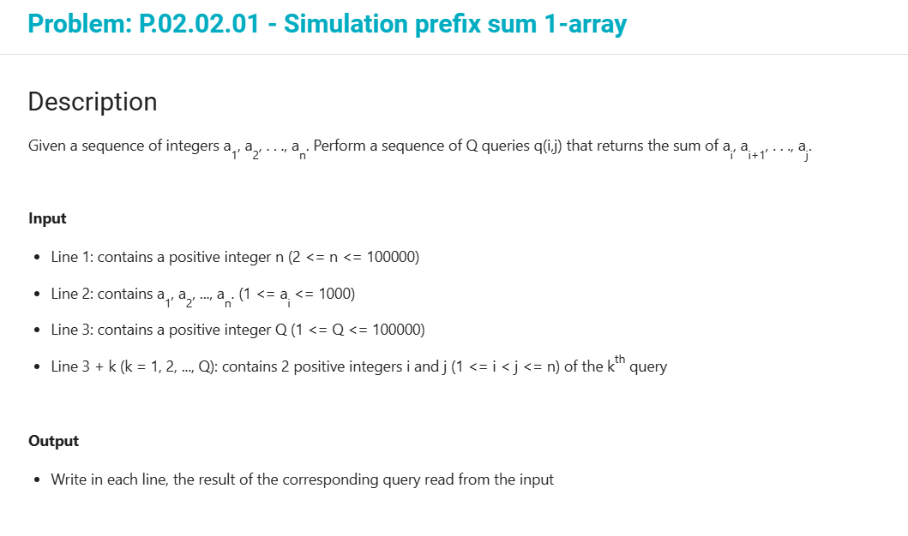
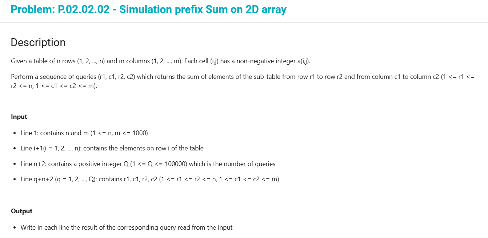

### Prefix sum 1D

> Mảng cộng dồn:
> Cho dãy a1, a2, .. an. Thực hiện Q truy vấn, mỗi truy vấn được đặc trưng bởi cặp chỉ số (i, j) trong đó cần tính tổng ai + .. + aj
> --> Độ phức tạp: O(n)
> 

### Prefix sum 2D

> Mảng cộng dòn 2 chiều
> Cho mảng 2 chiều a[1..n, 1..m], mảng cộng dồn s[1..n, 1..m] được định nghĩa như sau:
>
> - s[0,j] = 0, s[i, 0] = 0, i = 0..n và j = 0..m
> - Công thức truy hồi: s[i, j] = s[i-1, j] + s[i, j-1] - s[i-1, j-1] + a[i, j]
>   --> độ phức tạp: O(nm)

> Bài toán: Ta cần thực hiện Q truy vấn, mỗi truy vấn có dạng (a, b, c, d) được định nghĩa như sau:
> query[a, b, c, d] = ∑(k=a..c)∑(q=b..d) a[k, q]

> --> Công thức truy hồi: query[a, b, c, d] = s[c, d] - s[c, b-1] - s[a-1, d] + s[a-1, b-1];

> 
