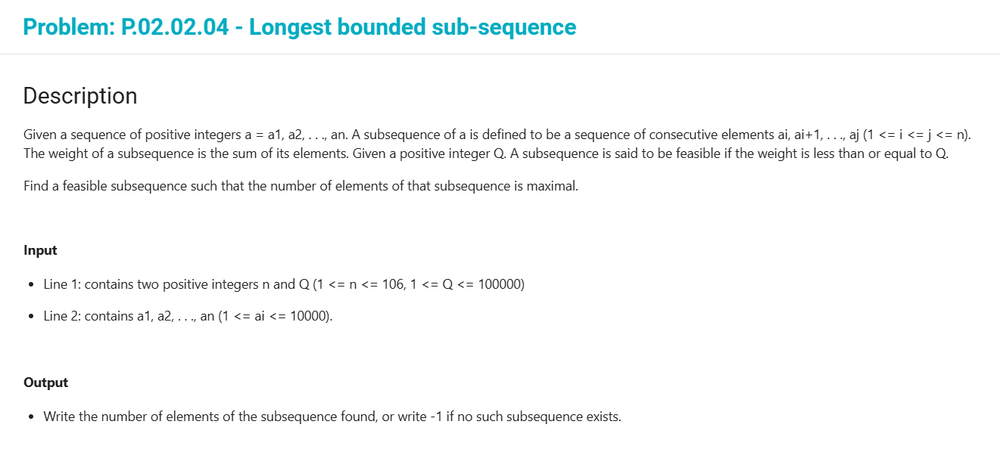

### Bài toán tìm đoạn con dài nhất thỏa mãn:
> Cho dãy số không âm a1, .. , an.
> Cho trước giá trị Q. 
> Hãy tìm dãy con (gồm 1 số phần tử liên tiếp cạnh nhau) dài nhất có tổng <= Q

> ==> In ra số phần tử của dãy đó.

> y/c: Độ phức tạp: O(n)

> Example: 
> - input: 
> 6 20
> 2 2 5 6 5 7 
> - output: 
> 5

### Bài toán Sum pair of sequence equal to a number

> Cho dãy a1, .. , an [được sắp xếp tăng dần] (các phần tử đôi một khác nhau)
> Cho trước giá trị Q, hãy đếm số cặp 2 chỉ số i và j sao cho a[i] + a[j] = Q

> --> Độ phức tạp: O(n)