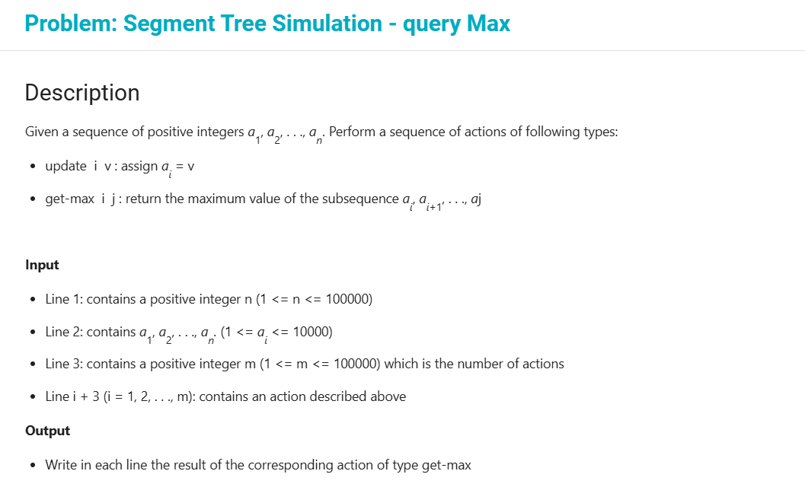

### Segment Tree

> **_ Bài toán: _**Cho dãy a1..an.
> Thực hiện một dãy các thao tác:
>
> - update i v : gán a[i] = v
> - get-max i j : trả về giá trị lớn nhất trong dãy ai .. aj

> ##### Nếu dùng thuật toán trực tiếp:
>
> - update: độ phức tạp O(1)
> - get-max: độ phức tạp O(j - i)

> ##### Nếu dùng cấu trúc segment tree:
>
> - update: độ phức tạp O(logN)
> - Độ cao của cây: O(logN) --> get-max có độ phức tạp 4 \* O(logN)

> --> Tổng quan thì segment tree có vẻ ổn định hơn.

> _test case_ :
> 10
> 1 10 9 7 1 4 2 4 8 10
> 5
> get-max 5 8
> get-max 5 9
> get-max 3 8
> update 9 20
> get-max 4 10

> _correct output:_
> 4
> 8
> 9
> 20
