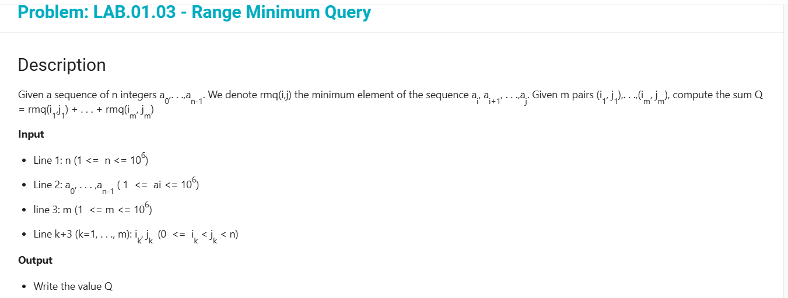
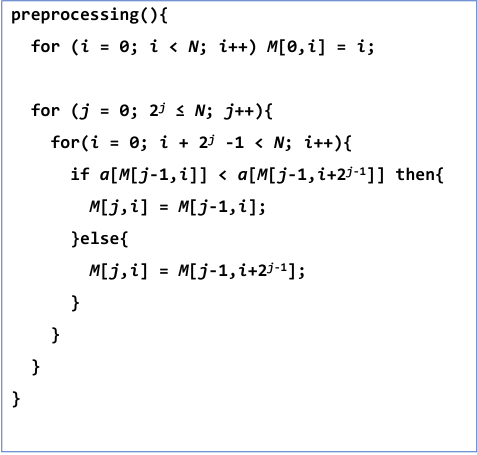
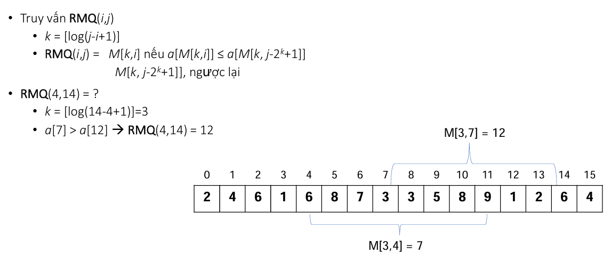

### Bài toán: Range Minimum Query 
> Cho dãy a[n]. Cho số nguyên dương K là số truy vấn
> mỗi truy vấn dạng (i, j) trả về chỉ số của phần tử nhỏ nhất của dãy ai .. aj
> Tính tổng các giá trị trả về đó.
> 

> Example
> - Input
> 16
> 2 4 6 1 6 8 7 3 3 5 8 9 1 2 6 4
> 4
> 1 5
> 0 9
> 1 15
> 6 10

> - Output
> 6

### Giải pháp độ phức tạp O(N):
> - *** Tiền xử lý: *** Tính M[i,j] là chỉ số phần tử nhỏ nhất trong dãy con bắt đầu từ a[j] và có 2^i phần tử  với i = 0, 1, 2 …, log2(N+1) và j = 0, 1, 2, …, N-1
> ![công thức truy hồi tìm M[i][j]](image-1.png)
> 
> - *** Truy vấn RMQ(i, j): ***
> 