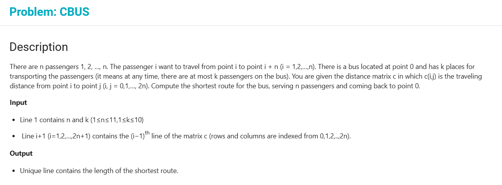

### Capacitated Bus 
> There are n passengers 1, 2, …, n.
> The passenger i want to travel from point i to point i + n (i =1,2,…,n).
> There is a bus located at point 0 and has k places for transporting the passengers (it means at any time, there are at most k passengers on the bus).
> You are given the distance matrix c in which c(i,j) is the traveling distance from point i to point j (i, j = 0,1,…, 2n).
> Compute the shortest route for the bus, serving n passengers and coming back to point 0.

> **Input**
> - Line 1 contains n and k (1≤n≤11,1≤k≤10)
> - Line i+1 (i=1,2,…,2n+1) contains the (i−1)th line of the matrix c (rows and columns are indexed from 0,1,2,..,2n).

> **Output**
> Unique line contains the length of the shortest route.

> ##### Example #####
> - *Input*
> 3  2
> 0  8  5  1  10  5  9
> 9  0  5  6  6  2  8
> 2  2  0  3  8  7  2
> 5  3  4  0  3  2  7
> 9  6  8  7  0  9  10
> 3  8  10  6  5  0  2
> 3  4  4  5  2  2  0
> - *Output*
> 25