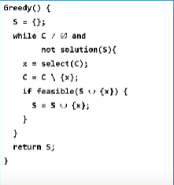

## Thuật toán tham lam
- Được sử dụng để giải một số bài toán tối ưu tổ hợp
- Đơn giản và tự nhiên
- Quá trình tìm lời giải diễn ra qua các bước
- Tại mỗi bước ra quyết định dựa trên các thông tin hiện tại mà không quan tâm đến ảnh hưởng của nó trong tương lai.
- Dễ đề xuất, cài đặt
- Thường không tìm được phương án tối ưu toàn cục

## Sơ đồ chung 
- Lời giải biểu diễn bởi tập S
- C biểu diễn các ứng cử viên
- select(C): chọn ra ứng cử viên tiềm năng nhất
- solution(S): trả về true nếu S là lời giải của bài toán
- feasible(S): trả về true nếu S không vi phạm ràng buộc nào của bài toán.
- 