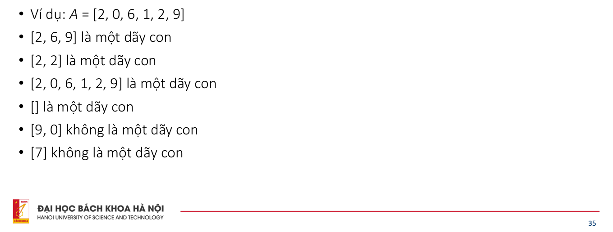
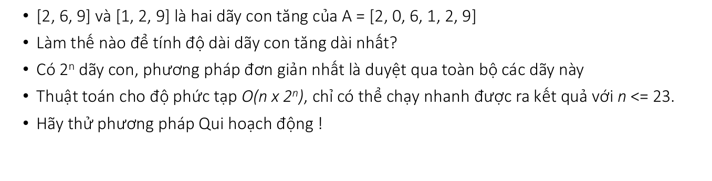
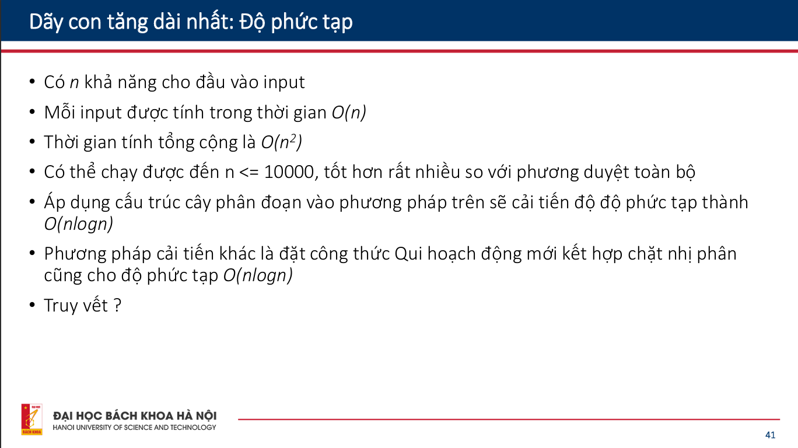
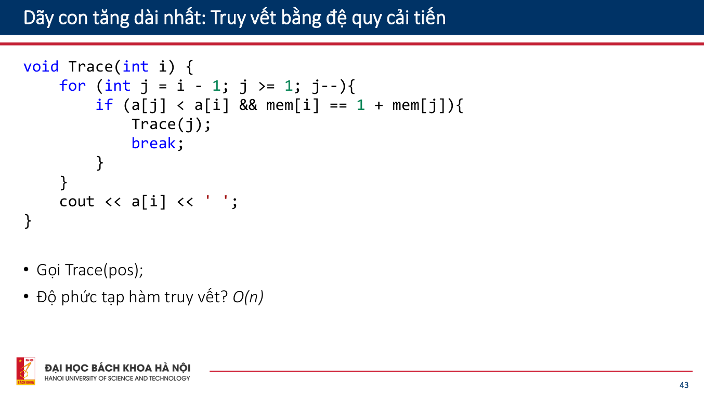

### Dãy con tăng dài nhất

**`Cho một dãy n số nguyên a[1]...a[n]. Tìm độ dài dãy con tăng dài nhất`**

> Định nghĩa: Nếu xóa đi 0 phần tử hoặc một số phần tử của dãy a thì thu được dãy con của a.

> Một dãy con tăng dài nhất của a là một dãy con của a sao cho các phần tử là tăng chặt từ trái sang phải.

- Gọi LIS(i) là độ dài dãy con tăng dài nhất của a[1]..a[i] mà kết thúc tại phần tử thứ i
- Bước cơ sở: ~~LIS[i] = a[1]~~ không cần thiết
- Bước chuyển qui nạp:
  

> Độ dài dãy con tăng dài nhất chính là giá trị lớn nhất trong các giá trị LIS(i)

